# Лабораторная работа 1

## _Задание 1_

```python
name = input("Имя: ")
age = int(input("Возраст: "))
print(f"Привет, {name}! Через год тебе будет {age+1}.")
```


## _Задание 2_

```python
a = float(input("a: ").replace(',','.'))
b = float(input("b: ").replace(',','.'))
summa = a + b
avg = summa / 2
print(f"sum={summa:.2f}; avg={avg:.2f}")
```


## _Задание 3_

```python
price, discount, vat = map(float, input().split())
base = price * (1 - discount/100)
vat_amount = base * (vat/100)
total = base + vat_amount
print(f"База после скидки: {base:.2f} ₽")
print(f"НДС:               {vat_amount:.2f} ₽")
print(f"Итого к оплате:    {total:.2f} ₽")
```


## _Задание 4_

```python
all_minutes = int(input("Минуты: "))
hour = all_minutes // 60
minute = all_minutes % 60
print(f"{hour}:{minute:02d}")
```


## _Задание 5_

```python
fio = input("ФИО: ").split()
len_fio = 0
for i in fio:
    len_fio += len(i)
print(f"Инициалы: {fio[0][0] + fio[1][0] + fio[2][0]}.")
print(f"Длина (символов): {len_fio + 2}")
```


## _Задание 6_

```python
kol_player = int(input())
online = 0
offline = 0
for player in range (kol_player):
    stroka = input().split()
    if stroka[-1] == 'True': online+=1
    else: offline+=1
print(online,offline)
```


## _Задание 7_

```python
stroka = input()
word = ''
ind_1 = -1
ind_2 = -1
flag = 0
for i in range(len(stroka)):
    if stroka[i].isupper() and ind_1 == -1:
        word += stroka[i]
        ind_1 = i
    if stroka[i].isdigit() and ind_2 == -1:
        word += stroka[i + 1]
        ind_2 = i + 1
        ind_pred = ind_2
    if ind_1 > -1 and ind_2 > -1 and flag == 0:
        step = ind_2-ind_1
        if i - ind_pred == step:
            word += stroka[i]
            ind_pred = i
            if stroka[i] == '.':
                print(word)
                flag = 1
```


# Лабораторная работа 2

## _Задание 1_
### Функция нахождения минимума и максимума
```python
def min_max(nums: list[float | int]) -> tuple[float | int, float | int]:
    if not nums:
        return "ValueError"
    min_zn = nums[0]
    max_zn = nums[0]
    for x in nums:
        if x < min_zn:
            min_zn = x
        if x > max_zn:
            max_zn = x
    return min_zn, max_zn
```
### Функция по отсортированному списку уникальных значений
```python
def unique_sorted(nums: list[float | int]) -> list[float | int]:
    return sorted(set(nums))
```
### Функция по расплющению списка списков/кортежей в один список по строкам
```python
def flatten(mat: list[list | tuple]) -> list:
    flat_list = []
    for i in mat:
        if not isinstance(i, (list, tuple)):
            return "TypeError"
        for j in i:
            flat_list.append(j)
    return flat_list
```
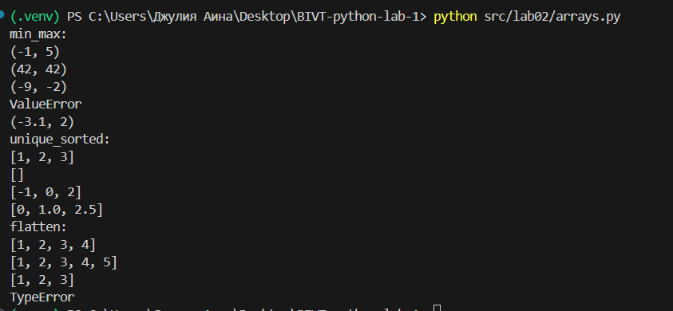

## _Задание 2_
### Дополнительная функция, проверяющая прямоугольность матрицы
```python
def check_rectangular(mat: list[list[float | int]]) -> bool:
    if not mat:
        return True
    len_row_1 = len(mat[0])
    for i, row in enumerate(mat):
        if len(row) != len_row_1:
            return False
```

### Функция, меняющая строки и столбцы местами
```python
def transpose(mat: list[list[float | int]]) -> list[list]:
    if not mat:
        return []
    if check_rectangular(mat) == False:
        return "ValueError"
    trans_mat = []
    for j in range (len(mat[0])):
        trans_row = []
        for i in range(len(mat)):
            trans_row.append(mat[i][j])
        trans_mat.append(trans_row)
    return trans_mat
```
### Функция нахождения суммы по каждой строке
```python
def row_sums(mat: list[list[float | int]]) -> list[float]:
    if not mat:
        return []
    if check_rectangular(mat) == False:
        return "ValueError"
    sum_row = []
    for row in mat:
        sum_row.append(float(sum(row)))
    return sum_row
```

### Функция нахождения суммы по каждому столбцу
```python
def col_sums(mat: list[list[float | int]]) -> list[float]:
    if not mat:
        return []
    if check_rectangular(mat) == False:
        return "ValueError"
    return row_sums(transpose(mat))
```
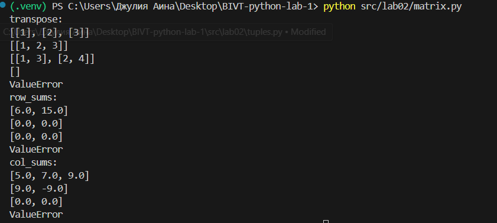

## _Задание 3_
### Возвращает строку вида: Иванов И.И., гр. BIVT-25, GPA 4.60
```python
def format_record(rec: tuple[str, str, float]) -> str:
    if not isinstance(rec, tuple) or len(rec) != 3:
        return ValueError()
    if not isinstance(rec[0], str):
        raise TypeError()
    if not isinstance(rec[1], str):
        raise TypeError()
    if not isinstance(rec[2], (int, float)):
        raise TypeError()
    
    fio, group, gpa = rec
    fio_f = ' '.join(fio.split()).split()
    if len(fio_f) < 2:
        return "ValueError"
    initials = []
    for i in fio_f[1:]:
        initials.append(i[0].upper() + '.')
    group_f = group.strip()
    if not group_f:
        return "ValueError"
    if gpa < 0:
        return "TypeError"
    return f"{fio_f[0].title()} {''.join(initials)}, гр. {group_f}, GPA {gpa:.2f}"
```
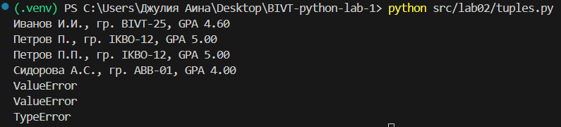

# Лабораторная работа 3
## Реализация функций в модуле 'src/lib/text.py'
###
```python
import re
def normalize(text: str, *, casefold: bool = True, yo2e: bool = True) -> str:
    if not text:
        return("")
    if casefold:
        text = text.casefold()
    if yo2e:
        text = text.replace('ё','е')
        text = text.replace('Ё','Е')
    text = re.sub(r'[\t\r\n]', ' ', text)
    text = re.sub(r'\s+', ' ', text).strip()
    return text
```

### Разбиение на «слова» по небуквенно-цифровым разделителям
```python
def tokenize(text: str) -> list[str]:
    if not text:
        return []
    f = r'\w+(?:-\w+)*'
    allf = re.findall(f, text)
    return allf
```

### Подсчет частот
```python
def count_freq(tokens: list[str]) -> dict[str, int]:
    freq_dict = {}
    for t in tokens:
        freq_dict[t] = freq_dict.get(t, 0) + 1
    return freq_dict
```

### Вывод топа-N по убыванию частоты
```python
def top_n(freq: dict[str, int], n: int = 5) -> list[tuple[str, int]]:
    sorted_items = sorted(freq.items(), key=lambda x: (-x[1], x[0]))
    return sorted_items[:n]
```
Проверим работоспособность функций:
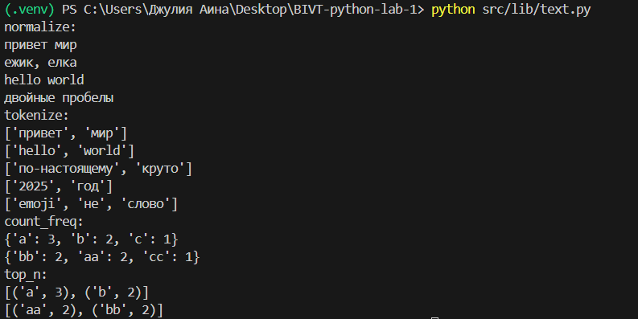

## Скрипт `src/lab03/text_stats.py`
Скрипт читает текста из терминала, вызывает функции из src/lib/text.py.
```python
import sys
import os
sys.path.append(os.path.join(os.path.dirname(__file__), '..', 'lib'))
from text import normalize, tokenize, count_freq, top_n

def print_table(top_words, total_words, unique_words): #Задание со звездочкой(табличный вывод)
    max_len = max(len(word) for word, i in top_words)
    column_width = max(max_len, 6) #Ширина первого столбца
    table_width = column_width + 15
    print(f"Всего слов: {total_words}")
    print(f"Уникальных слов: {unique_words}")
    print("Топ-5 самых частых слов:")

    print("┌" + "─" * (column_width + 2) + "┬" + "─" * 12 + "┐")
    print(f"│ { 'Слово':<{column_width}} │ {'Частота':<10} │")
    print("├" + "─" * (column_width + 2) + "┼" + "─" * 12 + "┤")

    for word, freq in top_words:
        print(f"│ {word:<{column_width}} │ {freq:<10} │")
    print("└" + "─" * (column_width + 2) + "┴" + "─" * 12 + "┘")

def main():
    table_mode = os.getenv('TABLE_MODE', '0') == '1'
    text = sys.stdin.read().strip()
    if not text:
        print("Всего слов: 0")
        print("Уникальных слов: 0")
        print("Топ-5: -")
        return
    normalized_text = normalize(text)
    tokens = tokenize(normalized_text)
    freq_dict = count_freq(tokens)

    total_words = len(tokens)
    unique_words = len(freq_dict)
    top_words = top_n(freq_dict, 5)
    if table_mode:
        print_table(top_words, total_words, unique_words)
    else:
        print(f"Всего слов: {total_words}")
        print(f"Уникальных слов: {unique_words}")
        print("Топ-5:")
        for word, count in top_words:
            print(f"{word}:{count}")

if __name__ == "__main__":
    main()
```
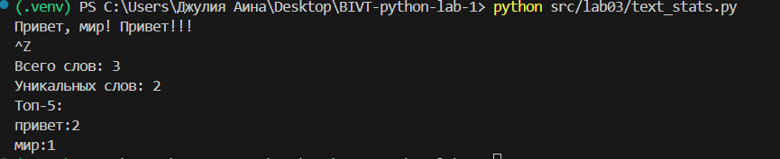

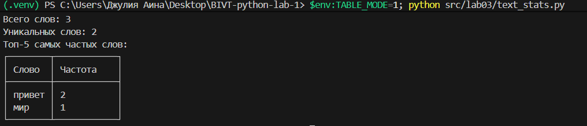
### Использование
C многострочным вводом: python src/lab03/text_stats.py -> [вводите текст] -> [Ctrl+z для завершения].

Табличный вывод мы используем через переменную окружения: в терминале -> $env:TABLE_MODE=1; python src/lab03/text_stats.py (для включения таблицы). Для обычного вывода - простое python src/lab03/text_stats.py, так как по умолчанию табличный вывод выключен.

## Лабораторная работа 4
### Модуль 'src/lib/io_txt_csv.py'
```python
from pathlib import Path
import csv
from typing import Iterable, Sequence, Union

def read_text(path: str | Path, encoding: str = "utf-8") -> str: 
    '''Открывает файл на чтение в указанной кодировке и возвращает содержимое как одну строку
    Аргументы: 
       path - путь к файлу (строка или объект Path)
       encoding - кодировка файла, по умолчанию utf-8
    Возвращает:
       данные файла как одну строку
    Ошибки:
       FileNotFoundError: если файл не найден
       UnicodeDecodeError: если кодировка не подходит
    Выбор другой кодировки:
        read_text("file.txt")  # по умолчанию чтение в utf-8
        read_text("file.txt", encoding="cp1251")  # чтение в Windows-1251  
    '''
    p = Path(path)
    return p.read_text(encoding=encoding)

def write_csv(rows: list[tuple | list], path: str | Path, header: tuple[str, ...] | None = None) -> None:
    '''Создает/перезаписывает CSV с разделителем ","
    Аргументы:
       rows - строки, являющиеся списком/кортежом
       path - путь к файлу
       header - заголовок (необязательный)
    Возвращает: ничего, сохраняет файл
    Ошибки:
       ValueError - если строки в rows не имеют одинаковую длину 
    '''
    p = Path(path)
    rows = list(rows)
    for i in range(len(rows) - 1): #проверка на одинаковость длин строк
        if len(rows[i]) != len(rows[i + 1]):
            raise ValueError
    with p.open("w", newline="", encoding="utf-8") as f: #открываю файл для записи, newline=""-контролирует, чтобы не было лишних переносов
        w=csv.writer(f) 
        if header is not None:
            w.writerow(header) #из тз, если передан header, то он записывается первой строкой
        for r in rows:
            w.writerow(r)
```
### Модуль 'src/lib/text_report.py'
```python
import sys
from pathlib import Path
#sys.path.append('C:\Users\User\Desktop\BIVT-python-lab-1/src')
from lib.text import normalize, tokenize, count_freq, top_n
from io_txt_csv import read_text, write_csv
sys.path.insert(0, str(Path(__file__).parent.parent))
 
def main():
    '''Читает один входной файл data/lab04/input.txt
    Нормализует текст (lib/text.py), токенизирует и считает частоты слов.
    Сохраняет data/report.csv c колонками: word,count, отсортированными: count ↓, слово ↑ (при равенстве).
    В консоль печатает краткое резюме:
       Всего слов: <N> 
       Уникальных слов: <K>
       Топ-5: (список из top_n)
    '''

    p=read_text("data/lab04/input.txt") 

    normalized_text = normalize(p)
    tokens = tokenize(normalized_text)
    freq_dict = count_freq(tokens)
    top_words = top_n(freq_dict, len(freq_dict))

    write_csv(top_n, "data/lab04/report.csv", ["word", "count"])
    #записывает данные из top в виде csv, в указанный путь, с заголовком

    top_5 = top_n(freq_dict, 5)
    print(f"Всего слов: {len(tokens)}")
    print(f"Уникальных слов: {len(freq_dict)}")
    print("Топ-5:")
    for word, count in top_5:
        print(f"{word}:{count}")

```

# Лабораторная работа 5
> **Цель:** Разобраться с форматом JSON, сериализацией/десериализацией и табличными конвертациями.

Создаю файл requirements.txt с одной зависимостью (openpyxl). Устанавливаю через терминал: pip install -r requirements.txt.
## Задание A — JSON ↔ CSV
### Функция json -> csv:
```python
import json
import csv
from pathlib import Path

def json_to_csv(json_path: str, csv_path: str) -> None:
    """ Преобразует JSON-файл в CSV.
    Поддерживает список словарей [{...}, {...}], заполняет отсутствующие поля пустыми строками.
    Кодировка UTF-8. 
    Проверка ошибок:
       - неверный тип файла, пустой JSON или CSV → ValueError.
       - осутствующий файл → FileNotFoundError
    """
    jp = Path(json_path)
    if jp.suffix != ".json":
        raise ValueError() # Выводим ошибку, если тип файла неверный
    if not jp.exists():
        raise FileNotFoundError() # Выводим ошибку, если файл не найден
    
    # Читаем файл JSON
    with open(json_path, "r", encoding="utf-8") as json_file:
        data = json.load(json_file)
    
    if len(data) == 0:
        raise ValueError("Пустой JSON")
    
    all_headers = set()
    for item in data:
        if not isinstance(item, dict):
            raise ValueError() # Проверяем, все ли элементы словари, если нет - ошибка
        all_headers.update(item.keys())  # добавляем все ключи объекта
    
    headers = sorted(all_headers)  # сортируем для порядка
    
    # Запись в CSV
    with open(csv_path, 'w', newline='', encoding='utf-8') as csv_file:
        writer = csv.DictWriter(csv_file, fieldnames=headers)
        writer.writeheader()
        
        for item in data:
            # Заполненяем отсутствующие поля для каждого объекта
            row = {header: item.get(header, '') for header in headers}
            writer.writerow(row)

```
Тестирую функцию через строку:
```python
json_to_csv("data/lab05/samples/people.json", "data/lab05/out/people_json.csv")
```
В результате в папке data/lab05/out создается CSV файл.
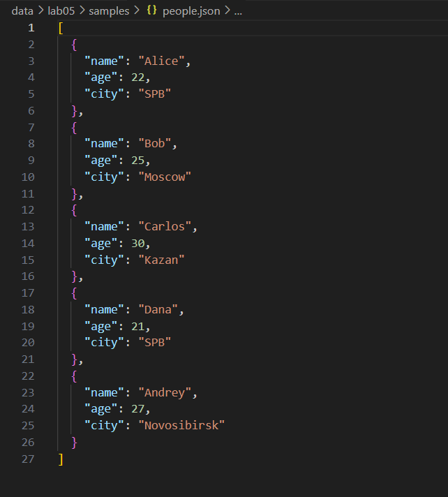
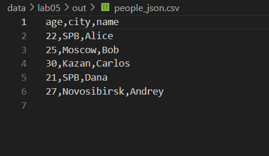

### Функция csv -> json:
```python
ef csv_to_json(csv_path: str, json_path: str) -> None:
    """ Преобразует CSV в JSON (список словарей).
    Заголовок обязателен, значения сохраняются как строки.
    json.dump(..., ensure_ascii=False, indent=2)
    """
    cp = Path(csv_path)
    if cp.suffix != ".csv":
        raise ValueError() # Выводим ошибку, если тип файла неверный
    if not cp.exists():
        raise FileNotFoundError() # Выводим ошибку, если файл не найден
    
    # Читаем файл CSV
    with open(csv_path, 'r', encoding='utf-8') as csv_file:
        reader = csv.DictReader(csv_file)
        rows = list(reader)
    
    if len(rows) == 0:
        raise ValueError() # Пустой CSV
    
    # Запись в JSON
    with open(json_path, 'w', encoding='utf-8') as json_file:
        json.dump(rows, json_file, ensure_ascii=False, indent=2)
```
Тестирую функцию через строку:
```python
csv_to_json("data/lab05/samples/people.csv", "data/lab05/out/people_csv.json")
```
В результате в папке data/lab05/out создается JSON файл.
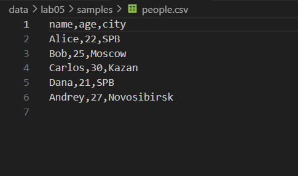
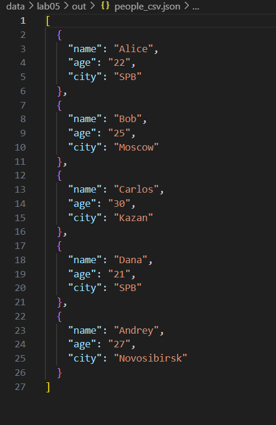

## Задание B — CSV → XLSX
### Функция csv -> xlsx:
```python
import csv
from openpyxl import Workbook
from openpyxl.utils import get_column_letter
from pathlib import Path

def csv_to_xlsx(csv_path: str, xlsx_path: str) -> None:
    """
    Конвертирует CSV в XLSX.
    Первая строка CSV — заголовок.
    Колонки — автоширина по длине текста (не менее 8 символов).
    Проверка ошибок:
       - неверный тип файла, пустой JSON или CSV → ValueError.
       - осутствующий файл → FileNotFoundError
    """
    wb=Workbook()
    ws=wb.active
    ws.title="Sheet1"

    csv_file=Path(csv_path)
    if not csv_file.exists():
        raise FileNotFoundError() # Выводим ошибку, если файл не найден
    if csv_file.suffix != '.csv':
        raise ValueError() # Выводим ошибку, если тип файла неверный
    
    # Чтение CSV данных
    with open(csv_path, 'r', encoding='utf-8') as f:
        reader= csv.DictReader(f)
        rows = list(reader)
    if len(rows)==0:
        raise ValueError("Файл не содержит данных") 
    if not reader.fieldnames:
        raise ValueError("Файл не содержит заголовка")
    
    ws.append(reader.fieldnames) # Запись заголовков

    r_count=0
    for row in rows:
        r_count+=1

        data_for_ex=[]
        for title in reader.fieldnames:
            data_for_ex.append(row[title])
        ws.append(data_for_ex)
    if r_count == 0:
        raise ValueError("Нет данных")


    for col_index in range(1,len(reader.fieldnames)+1):
        column_letter=get_column_letter(col_index)
        max_len=0


        for row in ws[column_letter]:
            if row.value is not None:
                max_len=max(max_len,len(str(row.value)))

        m_width=max(max_len+2, 8)
        ws.column_dimensions[column_letter].width =m_width


    xlsx_path = Path(xlsx_path)
    
    wb.save(xlsx_path)
```
Тестирую функцию через строки:
```python
csv_to_xlsx("data/lab05/samples/people.csv", "data/lab05/out/people.xlsx")
csv_to_xlsx("data/lab05/samples/cities.csv", "data/lab05/out/cities.xlsx")
```
В результате в папке data/lab05/out создаются два XLSX файлa.

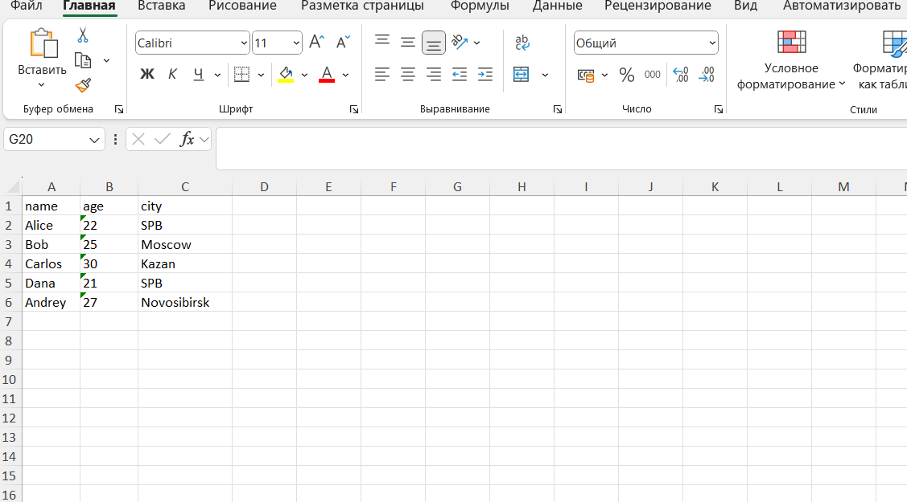
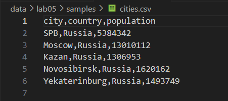
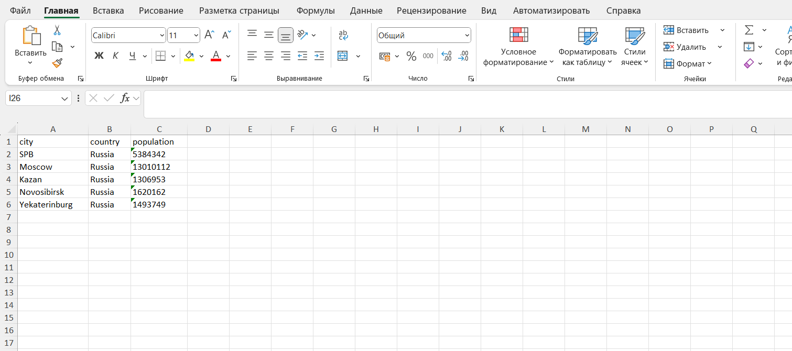

# Лабораторная работа 6
> **Цель:** Научиться создавать консольные инструменты с аргументами командной строки, подкомандами и флагами. 

## Модуль src/lab06/cli_text.py
Команда cat - вывод содержимого файла:
```bash
py -m src.lab06.cli_text cat --input data/lab05/samples/people.csv -n
```
**Аргументы:**
--input - путь к входному файлу (обязательный)
-n - нумеровать ли строки при выводе (опциональный)
Команда stats - анализ частот слов:
```bash
py -m src.lab06.cli_text stats --input data/lab05/samples/example1.txt --top 5
```
**Аргументы:**
--input - путь к текстовому файлу (обязательный)
--top - количество выводимых слов (по умолчанию 5)

**Код:**
```python
import argparse
from pathlib import Path
from src.lib.text import tokenize, count_freq, top_n

def main():
    parser = argparse.ArgumentParser(description="CLI‑утилиты лабораторной работы 6")
    subparsers = parser.add_subparsers(dest="command")

    # подкоманда cat
    cat_parser = subparsers.add_parser("cat", help="Вывести содержимое файла")
    cat_parser.add_argument("--input", required=True, help="Путь к входному файлу")
    cat_parser.add_argument("-n", action="store_true", help="Нумеровать строки")

    # подкоманда stats
    stats_parser = subparsers.add_parser("stats", help="Частоты слов")
    stats_parser.add_argument("--input", required=True, help="Входной текстовый файл")
    stats_parser.add_argument("--top", type=int, default=5)

    args = parser.parse_args()

    file = Path(args.input)

    if args.command == "cat":
        " вывод содержимого файла построчно (с нумерацией при -n). "

        with open(file, "r", encoding="utf-8") as f:
            number = 1
            for row in f:
                row = row.rstrip("\n") 
                if args.n: # при указанном флаге выводятся пронумерованные строки
                    print(f"{number}. {row}")
                    number += 1
                else:
                    print(row)
    
    elif args.command == "stats":
        " анализ частот слов в тексте "
        with open(file, "r", encoding="utf-8") as f:
            data = [row for row in f]
        data = "".join(data)
        tokens = tokenize(text=data)
        freq = count_freq(tokens=tokens)
        top = top_n(freq=freq, n=args.top)

        print(f"Топ-{args.top} слов в файле '{args.input}':")
        number = 1
        for x, y in top:
            print(f"{number}. '{x}' - {y}")
            number += 1

if __name__ == "__main__":
    main()
```
**Результаты запуска:**
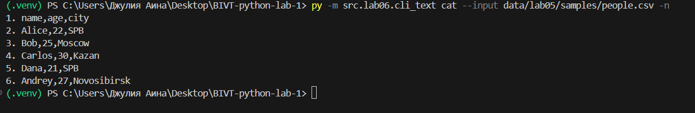
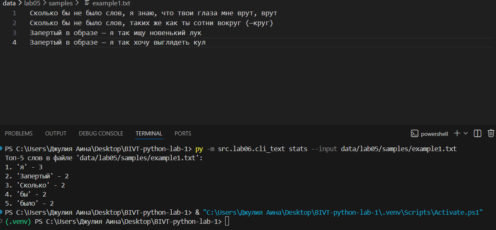

**Справка Help:**
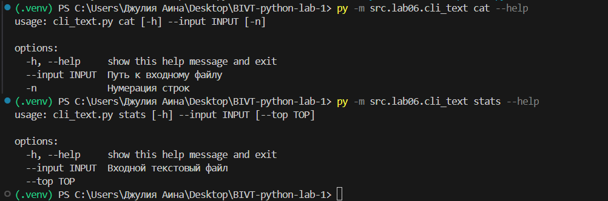

## Модуль src/lab06/cli_convert.py
Команда json2csv, конвертирует JSON в CSV
```bash
py -m src.lab06.cli_convert json2csv --in data/lab06/samples/people.json --out data/lab06/out/people_json.csv
```
Команда csv2xlsx, конвертирует CSV в XLSX
```bash
py -m src.lab06.cli_convert csv2json --in data/lab06/samples/people.csv --out data/lab06/out/people_csv.json
```
Команда csv2json, конвертирует CSV в JSON
```bash
py -m src.lab06.cli_convert csv2xlsx --in data/lab05/samples/cities.csv --out data/lab06/out/cities_csv.xlsx
```
**Аргументы:**
--in - входной JSON/CSV файл (обязательный)
--out - выходной CSV/JSON/XLSX файл (обязательный)

**Код:**
```python
import argparse
from src.lab05.json_csv import json_to_csv, csv_to_json
from src.lab05.csv_xlsx import csv_to_xlsx

def main():
    parser = argparse.ArgumentParser(description="Конвертеры данных")
    sub = parser.add_subparsers(dest="cmd")

    json_to_csv_p = sub.add_parser("json2csv", help="Конвертировать JSON в CSV")
    json_to_csv_p.add_argument("--in", dest="input", required=True)
    json_to_csv_p.add_argument("--out", dest="output", required=True)

    csv_to_json_p = sub.add_parser("csv2json",  help="Конвертировать CSV в JSON")
    csv_to_json_p.add_argument("--in", dest="input", required=True)
    csv_to_json_p.add_argument("--out", dest="output", required=True)

    csv_to_xlsx_p = sub.add_parser("csv2xlsx", help="Конвертировать CSV в XLSX")
    csv_to_xlsx_p.add_argument("--in", dest="input", required=True)
    csv_to_xlsx_p.add_argument("--out", dest="output", required=True)

    args = parser.parse_args()

    if args.cmd == "json2csv":
        json_to_csv(json_path=args.input, csv_path=args.output)
    elif  args.cmd == "csv2json":
        csv_to_json(csv_path=args.input, json_path=args.output)
    elif args.cmd == "csv2xlsx":
        csv_to_xlsx(csv_path=args.input, xlsx_path=args.output)

if __name__ == "__main__":
    main()
```
**Результаты запуска:**

 
 
 

**Справка Help:**
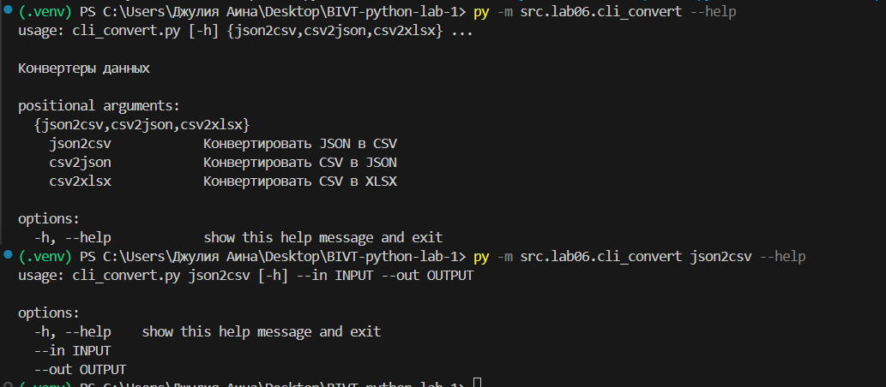

# Лабораторная работа 7
> **Цель:** Научиться писать модульные тесты на pytest, измерять покрытие и поддерживать единый стиль кода (black).

## Задание A. Тесты для src/lib/text.py
```python
import pytest
from src.lib.text import normalize, tokenize, count_freq, top_n

@pytest.mark.parametrize(
    "source, expected",
    [
        ("ПрИвЕт\nМИр\t", "привет мир"),
        ("ёжик, Ёлка", "ежик, елка"),
        ("Hello\r\nWorld", "hello world"),
        ("  двойные   пробелы  ", "двойные пробелы"),
        ("", "")
    ],
)
def test_normalize_basic(source, expected):
    assert normalize(source) == expected

@pytest.mark.parametrize(
    "src,expected",
    [
        ("привет мир", ["привет", "мир"]),
        ("hello,world!!!", ["hello", "world"]),
        ("по-настоящему круто", ["по-настоящему", "круто"]),
        ("2025 год", ["2025", "год"]),
        ("emoji 😀 не слово", ["emoji", "не", "слово"]),
        ("", [])
    ],
)
def test_tokenize(src, expected):
    assert tokenize(src) == expected

def test_count_freq_and_top_n():
    tokens = ["a", "b", "a", "c", "b", "a"]
    freq = count_freq(tokens)
    assert freq == {"a": 3, "b": 2, "c": 1}
    assert top_n(freq, 2) == [("a", 3), ("b", 2)]

    freq = count_freq(["bb", "aa", "bb", "aa", "cc"])
    assert top_n(freq, 2) == [("aa", 2), ("bb", 2)]

    assert count_freq([]) == {}
    assert top_n({}, 5) == []
```

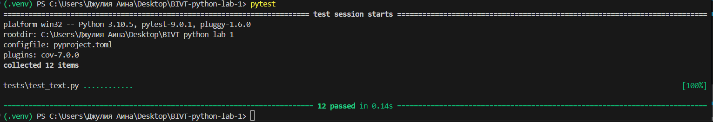

## Задание B. Тесты для src/lab05/json_csv.py
```python
import json, csv
from pathlib import Path
import pytest

from src.lab05.json_csv import json_to_csv, csv_to_json

def write_json(path: Path, obj):
    path.write_text(json.dumps(obj, ensure_ascii=False, indent=2), encoding="utf-8")

def read_csv_rows(path: Path):
    with path.open(encoding="utf-8") as f:
        return list(csv.DictReader(f))


def test_json_to_csv_roundtrip(tmp_path: Path):
    src = tmp_path / "people.json"
    dst = tmp_path / "people.csv"
    data = [{"name": "Alice", "age": 22}, {"name": "Bob", "age": 25}]
    write_json(src, data)

    json_to_csv(str(src), str(dst))
    rows = read_csv_rows(dst)
    assert len(rows) == 2
    assert set(rows[0]) >= {"name", "age"}

    #Тест для пустого JSON:
    src = tmp_path / "empty.json"
    dst = tmp_path / "empty.csv"
    src.write_text("[]", encoding="utf-8")

    try:
        json_to_csv(str(src), str(dst))
        if dst.exists():
            pass
    except (ValueError, IndexError):
        pass


def test_csv_to_json_roundtrip(tmp_path: Path):
    src = tmp_path / "people.csv"
    dst = tmp_path / "people.json"
    src.write_text("name,age\nAlice,22\nBob,25\n", encoding="utf-8")

    csv_to_json(str(src), str(dst))
    obj = json.loads(dst.read_text(encoding="utf-8"))
    assert isinstance(obj, list) and len(obj) == 2
    assert set(obj[0]) == {"name", "age"}

    #Тест для пустого CSV
    src = tmp_path / "empty.csv"
    dst = tmp_path / "empty.json"
    src.write_text("", encoding="utf-8")

    try:
        csv_to_json(str(src), str(dst))
        if dst.exists():
            pass
    except (ValueError, Exception):
        pass
```

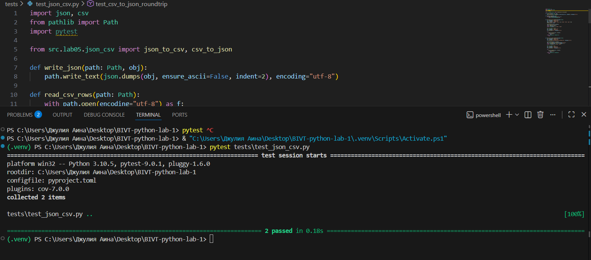

## Задание C. Стиль кода (black)
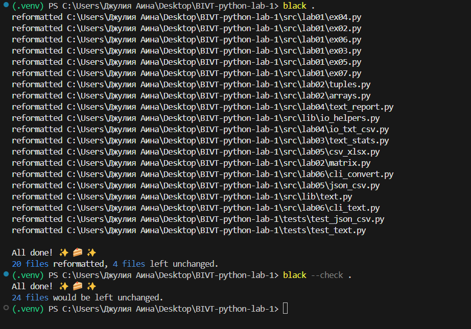

# Лабораторная работа 8
> **Цель:** Изучить основы объектно-ориентированного программирования в Python, научиться описывать модели данных с помощью @dataclass, реализовывать методы и валидацию, сериализовывать/десериализовывать объекты.

## Задание A. класс Student (models.py)
```python
from dataclasses import dataclass
from datetime import datetime, date
import re

@dataclass
class Student:
    fio: str
    birthdate: str
    group: str
    gpa: float

    def __post_init__(self):
        # проверяет данные
        try:
            datetime.strptime(self.birthdate, "%Y-%m-%d")
        except ValueError:
            raise ValueError(f"Неправильный формат даты: {self.birthdate}. Нужно: ГГГГ-ММ-ДД")
        
        if not (0 <= self.gpa <= 5):
            raise ValueError(f"Средний балл должен быть от 0 до 5, а у вас: {self.gpa}")

    def age(self) -> int:
        # вернуть количество полных лет
        birth = datetime.strptime(self.birthdate, "%Y-%m-%d").date()
        today = date.today()
        if (today.month, today.day) < (birth.month, birth.day):
            return today.year - birth.year -1
        return today.year - birth.year

    def to_dict(self) -> dict:
        # сериализация
        return {
            "fio": self.fio,
            "birthdate": self.birthdate,
            "group":self.group,
            "gpa": self.gpa
        }

    @classmethod
    def from_dict(cls, d: dict):
        # десереализация из словаря
        return cls(
            fio = d["fio"],
            birthdate = d["birthdate"],
            group = d["group"],
            gpa = d["gpa"]
        )

    def __str__(self) -> str:
        # красивый вывод
        return f"{self.fio}: группа: {self.group}, возраст: {self.age()}, GPA: {self.gpa}"
```

## Задание B. модуль serialize.py
```python
import json
from .models import Student

def students_to_json(students, path):
    "Сохранение списка студентов в JSON файл."
    data = [student.to_dict() for student in students]

    with open(path, "w", encoding="utf-8") as f:
        json.dump(data, f, ensure_ascii=False, indent=2, sort_keys=True)

    print(f"Данные сохранены в файл: {path}")

def students_from_json(path: str) -> list[Student]:
    "Загрузка списка студентов из JSON файла."
  
    try:
        with open(path, 'r', encoding='utf-8') as f:
            data = json.load(f)
        
        students = [Student.from_dict(item) for item in data]
        
        print(f"Загружено {len(students)} студентов из файла: {path}")
        return students
    
    except FileNotFoundError:
        print(f"Файл не найден: {path}")
        return []
    except json.JSONDecodeError:
        print(f"Ошибка в формате JSON файла: {path}")
        return []
```

**Пример запуска:**
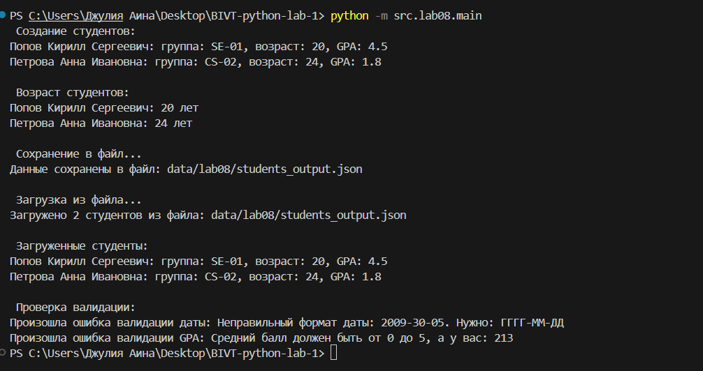

**Примеры JSON до/после преобразования:**
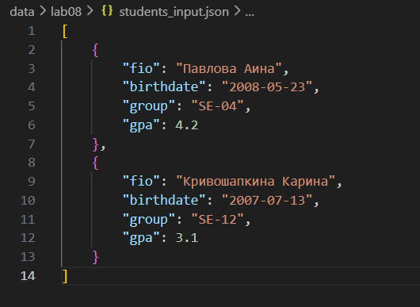
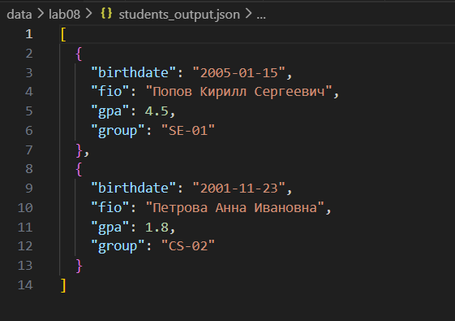

# Лабораторная работа 9
> **Цель:** 

## Задание A. 