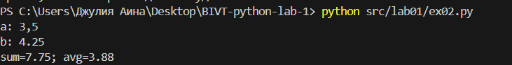

## Лабораторная работа 1

### _Задание 1_

```python
name = input("Имя: ")
age = int(input("Возраст: "))
print(f"Привет, {name}! Через год тебе будет {age+1}.")
```


### _Задание 2_

```python
a = float(input("a: ").replace(',','.'))
b = float(input("b: ").replace(',','.'))
summa = a + b
avg = summa / 2
print(f"sum={summa:.2f}; avg={avg:.2f}")
```


### _Задание 3_

```python
price, discount, vat = map(float, input().split())
base = price * (1 - discount/100)
vat_amount = base * (vat/100)
total = base + vat_amount
print(f"База после скидки: {base:.2f} ₽")
print(f"НДС:               {vat_amount:.2f} ₽")
print(f"Итого к оплате:    {total:.2f} ₽")
```


### _Задание 4_

```python
all_minutes = int(input("Минуты: "))
hour = all_minutes // 60
minute = all_minutes % 60
print(f"{hour}:{minute:02d}")
```


### _Задание 5_

```python
fio = input("ФИО: ")
fio_no_probel = ' '.join(fio.split())
words = fio_no_probel.split()
initials = ''.join([i[0].upper() for i in words])
print(f"Инициалы: {initials}.")
print(f"Длина (символов): {len(fio_no_probel)}")
```


### _Задание 6_

```python
n = int(input())
online = 0
offline = 0
for i in range (n):
    stroka = input().split()
    if stroka[-1] == 'True': online+=1
    else: offline+=1
print(online,offline)

```


### _Задание 7_

```python
stroka = input()
word =''
ind1 = -1
ind2 = -1
k = 0
for i in range(len(stroka)):
    if stroka[i].isupper() and ind1 == -1:
        word += stroka[i]
        ind1 = i
    if stroka[i].isdigit() and ind2 == -1:
        word += stroka[i + 1]
        ind2 = i + 1
        indp = ind2
    if ind1 > -1 and ind2 > -1 and k == 0:
        step = ind2-ind1
        if i - indp == step:
            word+=stroka[i]
            indp = i
            if stroka[i] == '.':
                print(word)
                k = 1
```


## Лабораторная работа 2
