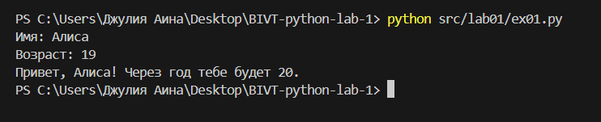

## Лабораторная работа 1

### _Задание 1_

```python
name = input("Имя: ")
age = int(input("Возраст: "))
print(f"Привет, {name}! Через год тебе будет {age+1}.")
```


### _Задание 2_

```python
a = float(input("a: ").replace(',','.'))
b = float(input("b: ").replace(',','.'))
summa = a + b
avg = summa / 2
print(f"sum={summa:.2f}; avg={avg:.2f}")
```


### _Задание 3_

```python
price, discount, vat = map(float, input().split())
base = price * (1 - discount/100)
vat_amount = base * (vat/100)
total = base + vat_amount
print(f"База после скидки: {base:.2f} ₽")
print(f"НДС:               {vat_amount:.2f} ₽")
print(f"Итого к оплате:    {total:.2f} ₽")
```


### _Задание 4_

```python
all_minutes = int(input("Минуты: "))
hour = all_minutes // 60
minute = all_minutes % 60
print(f"{hour}:{minute:02d}")
```


### _Задание 5_

```python
fio = input("ФИО: ").split()
len_fio = 0
for i in fio:
    len_fio += len(i)
print(f"Инициалы: {fio[0][0] + fio[1][0] + fio[2][0]}.")
print(f"Длина (символов): {len_fio + 2}")
```


### _Задание 6_

```python
kol_player = int(input())
online = 0
offline = 0
for player in range (kol_player):
    stroka = input().split()
    if stroka[-1] == 'True': online+=1
    else: offline+=1
print(online,offline)
```


### _Задание 7_

```python
stroka = input()
word = ''
ind_1 = -1
ind_2 = -1
flag = 0
for i in range(len(stroka)):
    if stroka[i].isupper() and ind_1 == -1:
        word += stroka[i]
        ind_1 = i
    if stroka[i].isdigit() and ind_2 == -1:
        word += stroka[i + 1]
        ind_2 = i + 1
        ind_pred = ind_2
    if ind_1 > -1 and ind_2 > -1 and flag == 0:
        step = ind_2-ind_1
        if i - ind_pred == step:
            word += stroka[i]
            ind_pred = i
            if stroka[i] == '.':
                print(word)
                flag = 1
```


## Лабораторная работа 2
